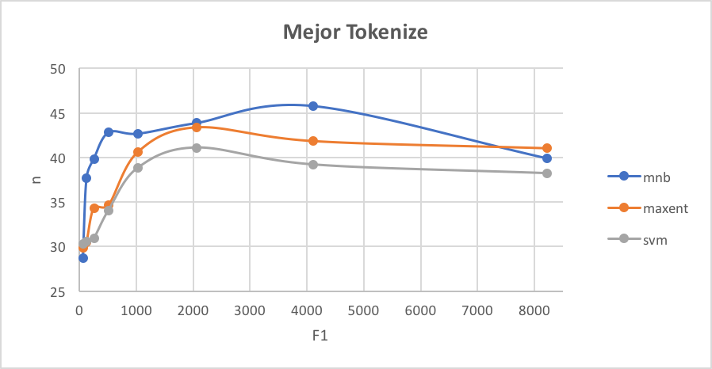
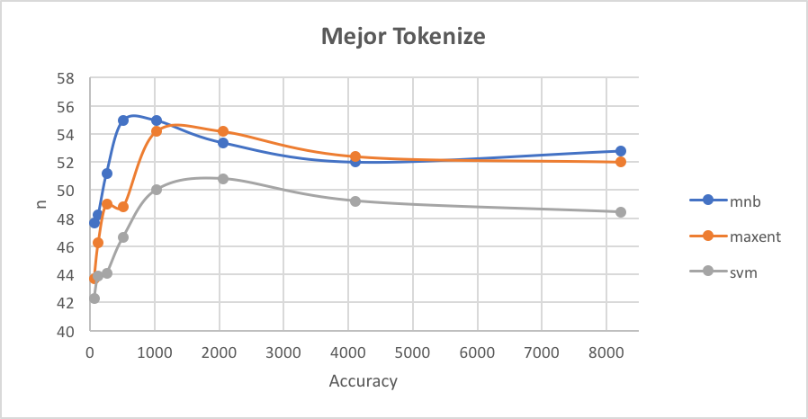
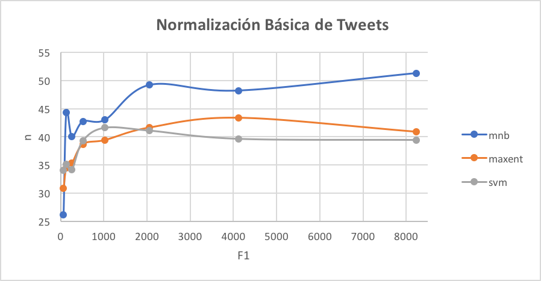
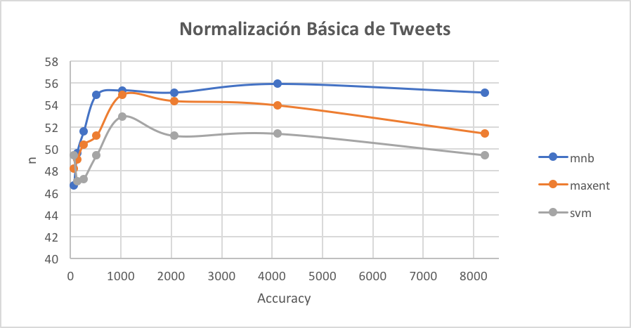
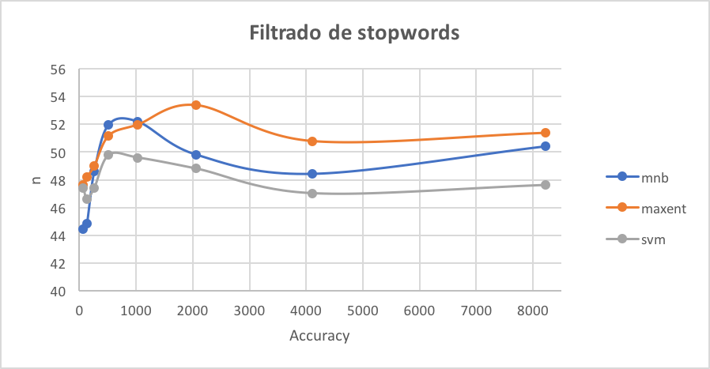
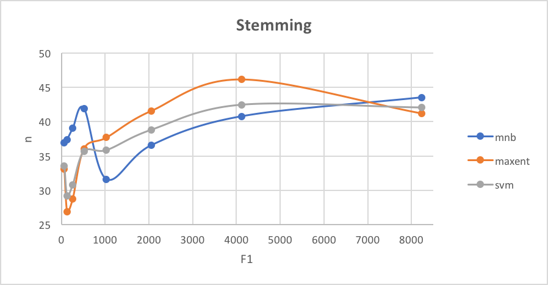
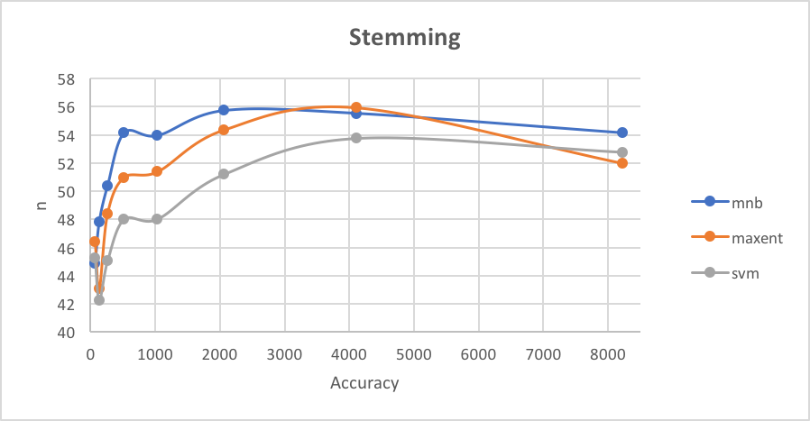

# Práctico 3

## Ejercicio 1: Corpus de Tweets: Estadísticas Básicas
Se genera el archivo `stats.py` que mostrará estadísticas sobre el corpus
de tweets de `InterTass` y `GeneralTASS`. Se muestra a continuación el
resultado que se obtiene de ejecutar el script.

```
Estadísticas de InterTass
================
Cantidad total de tweets: 1008
Cantidad de tweets con polaridad P: 318
Cantidad de tweets con polaridad N: 418
Cantidad de tweets con polaridad NEG: 133
Cantidad de tweets con polaridad NONE: 139
================


Estadísticas de GeneralTass
================
Cantidad total de tweets: 7219
Cantidad de tweets con polaridad P: 2884
Cantidad de tweets con polaridad N: 2182
Cantidad de tweets con polaridad NEG: 670
Cantidad de tweets con polaridad NONE: 1483
================
```

## Ejercicio 2: Mejoras al Clasificador Básico de Polaridad
En este ejercicio se implementan cuatro mejoras en el clasificador de
sentimientos ya implementado. Se decidió implementar las siguientes:

* **Mejor Tokenizer**: Se resuelve utilizando el tokenizer para tweets
del NLTK.
* **Normalización Básica de Tweets**: Antes de entrenar el corpus, se
_limpian_ las oraciones eliminando las referencias a otros usuarios,
las urls y las repeticiones de vocales.
* **Filtrado de stopwords**: Se setea el `CountVectorizer` para que ignore
stopwords del castellano. Se utiliza el que provee NLTK.
* **Stemming**: Se modifica el tokenizador del `CountVectorizer` para que
haga stemming sobre las palabras. Se utiliza el Snowball stemmer que provee
NLTK. 

Veamos que ocurra al implementar cada una de las mejoras por separado
y al implementar todas en conjunto.

Resultados de la curva de aprendizaje para los tres clasificadores.
### Mejor Tokenize



### Normalización Básica de Tweets



### Filtrado de stopwords



### Stemming



<!-------------------------------->
<!--Resultado de la evaluación sobre el corpus de development de InterTASS. Usar el script eval.py.-->

| Improve | Model |  Classifier | P - Precision | P - Recall | P - F1   | N - Precision | N - Recall | N - F1   | NEU - Precision | NEU - Recall | NEU - F1   | NONE - Precision | NONE - Recall | NONE - F1 | Accuracy  | Macro-Precision   | Macro-Recall  | Macro-F1  |
|:---------:|:---------:|:---------:|:---------:|:---------:|:---------:|:---------:|:---------:|:---------:|:---------:|:---------:|:---------:|:---------:|:---------:|:---------:|:---------:|:---------:|:---------:|:---------:|
| - | Most frequent sentiment | -                                                       | 30.83%	        | 100.00%           | 47.13% | 100.00%	        | 0.00%	            | 0.00%	 | 100.00%	     | 0.00%	    |0.00%	| 100.00%	    | 0.00%	        | 0.00%	| 30.83%          | 82.71% | 25.00% | 38.39%    |
| Mejor Tokenize | Machine Learning Classifier | Multinomial Bayes                      | 51.61% (128/248)  | 82.05% (128/156)  | 63.37% | 58.20% (149/256) | 68.04% (149/219)  | 62.74% | 100.00% (0/0) | 0.00% (0/69) | 0.00% | 100.00% (2/2) | 3.23%  (2/62) | 6.25% | 55.14% (279/506)| 77.45% | 38.33% | 51.28%    |
| Mejor Tokenize | Machine Learning Classifier | Maximum Entropy                        | 53.30% (105/197)  | 67.31% (105/156)  | 59.49% | 62.04% (134/216) | 61.19% (134/219)  | 61.61% | 29.41% (5/17) | 7.25% (5/69) | 11.63%| 21.05% (16/76)| 25.81% (16/62)| 23.19%| 51.38% (260/506)| 41.45% | 40.39% | 40.91%    |
| Mejor Tokenize | Machine Learning Classifier | Support Vector Machine                 | 54.89% (101/184)  | 64.74 (101/156)   | 59.41% | 63.27% (124/196) | 56.62% (124/219)  | 59.76% | 13.95% (6/43) | 8.70% (6/69) | 10.71%| 22.89% (19/83)| 30.65% (19/62)| 26.21%| 49.41% (250/506)| 38.75% | 40.18% | 39.45%    |
| Normalización Básica de Tweets | Machine Learning Classifier | Multinomial Bayes      | 47.25% (129/273)  | 82.69% (129/156)  | 60.14% | 59.39% (136/229) | 62.10% (136/219)  | 60.71% | 0.00% (0/1)   | 0.00% (0/69) | 0.00% | 66.67% (2/3)  | 3.23%  (2/62) | 6.15% | 52.77% (267/506)| 43.33% | 37.00% | 39.92%    |
| Normalización Básica de Tweets | Machine Learning Classifier | Maximum Entropy        | 51.09% (117/229)  | 75.00% (117/156)  | 60.78% | 61.88% (125/202) | 57.08% (125/219)  | 59.38% | 20.00% (4/20) | 5.80% (4/69) | 8.99% | 27.27% (15/55)| 24.19% (15/62)| 25.64%| 51.58% (261/506)| 40.06% | 40.52% | 40.29%    |
| Normalización Básica de Tweets | Machine Learning Classifier | Support Vector Machine | 53.12% (102/192)  | 65.38% (102/156)  | 58.62% | 62.11% (118/190) | 53.88% (118/219)  | 57.70% | 15.79% (6/38) | 8.70% (6/69) | 11.21%| 22.09% (19/86)| 30.65% (19/62)| 25.68%| 48.42% (245/506)| 38.28% | 39.65% | 38.95%    |
| Filtrado de stopwords | Machine Learning Classifier | Multinomial Bayes               | 43.88% (129/294)  | 82.69% (129/156)  | 57.33% | 60.71% (119/196) | 54.34% (119/219)  | 57.35% | 20.00% (1/5)  | 1.45% (1/69) | 2.70% | 54.55% (6/11) | 9.68%  (6/62) | 16.44%| 50.40% (255/506)| 44.78% | 37.04% | 40.55%    |
| Filtrado de stopwords | Machine Learning Classifier | Maximum Entropy                 | 48.71% (113/232)  | 72.44% (113/156)  | 58.25% | 61.84% (128/207) | 58.45% (128/219)  | 60.09% | 21.43% (3/14) | 4.35% (3/69) | 7.23% | 30.19% (16/53)| 25.81% (16/62)| 27.83%| 51.38% (260/506)| 40.54% | 40.26% | 40.40%    |
| Filtrado de stopwords | Machine Learning Classifier | Support Vector Machine          | 50.50% (101/200)  | 64.74% (101/156)  | 56.74% | 61.83% (115/186) | 52.51% (115/219)  | 56.79% | 17.65% (6/34) | 8.70% (6/69) | 11.65%| 22.09% (19/86)| 30.65% (19/62)| 25.68%| 47.63% (241/506)| 38.02% | 39.15% | 38.57%    |
    | Stemming | Machine Learning Classifier | Multinomial Bayes                            | 48.46% (126/260)  | 80.77% (126/156)  | 60.58% | 60.25% (147/244) | 67.12% (147/219)  | 63.50% | 0.00% (0/1)   | 0.00% (0/69) | 0.00% | 100.00% (1/1) | 1.61%  (1/62) | 3.17% | 54.15% (274/506)| 52.18% | 37.38% | 43.55%    |
| Stemming | Machine Learning Classifier | Maximum Entropy                              | 49.33% (110/223)  | 70.51% (110/156)  | 58.05% | 61.50% (131/213) | 59.82% (131/219)  | 60.65% | 17.65% (3/17) | 4.35% (3/69) | 6.98% | 35.85% (19/53)| 30.65% (19/62)| 33.04%| 51.98% (263/506)| 41.08% | 41.33% | 41.21%    |
| Stemming | Machine Learning Classifier | Support Vector Machine                       | 55.79% (106/190)  | 67.95% (106/156)  | 61.27% | 63.81% (134/210) | 61.19% (134/219)  | 62.47% | 14.29% (5/35) | 7.25% (5/69) | 9.62% | 30.99% (22/71)| 35.48% (22/62)| 33.08%| 52.77% (267/506)| 41.22% | 42.97% | 42.07%    |
| Todas las mejoras | Machine Learning Classifier | Multinomial Bayes                   | 44.98% (130/289)  | 83.33% (130/156)  | 58.43% | 65.17% (131/201) | 59.82% (131/219)  | 62.38% | 0.00% (0/3)   | 0.00% (0/69) | 0.00% | 38.46% (5/13) | 8.06%  (5/62) | 13.33%| 52.57% (266/506)| 37.15% | 37.80% | 37.48%    |
| Todas las mejoras | Machine Learning Classifier | Maximum Entropy                     | 50.44% (114/226)  | 73.08% (114/156)  | 59.69% | 67.20% (127/189) | 57.99% (127/219)  | 62.25% | 16.67% (3/18) | 4.35% (3/69) | 6.90% | 30.14% (22/73)| 35.48% (22/62)| 32.59%| 52.57% (266/506)| 41.11% | 42.72% | 41.90%    |
| Todas las mejoras | Machine Learning Classifier | Support Vector Machine              | 50.50% (102/202)  | 65.38% (102/156)  | 56.98% | 62.92% (112/178) | 51.14% (112/219)  | 56.42% | 15.56% (7/45) | 10.14% (7/69)| 12.28%| 32.10% (26/81)| 41.94% (26/62)| 36.36%| 48.81% (247/506)| 40.27% | 42.15% | 41.19%    |

Para el modelo de `machine learning` con el clasificador `multinomial bayes`
con la mejora en el tokenizador (se utiliza el ofrecido por la librería
NLTK), podemos observar que tiene un mejor comportamiento de predicción con
respecto al resto. Sin embargo, en las polaridades `NEU` y `NONE`, este clasificador
no presenta resultados coerentes. En el caso de la polaridad `NEU` se
observa que de 69 oraciones que debían tener esta etiqueta, el clasificador
no acertó en ninguna. Además, quisiera destacar que en el porcentaje de precisión
para la polaridad `NEU` es de `100%`, sin embargo se aciertan cero de cero oraciones.
Esto hace que se obtengan porcentajes altos en los valores totales, cuando
no son ciertos. Ignoremos los resultados para ese clasificador y mejora.

Por otro lado, con el mismo clasificador pero aplicando la mejora de stemming,
podemos observar una leve mejora acertando en la polaridad de `NONE`, pero sigue
sin ser significativa. Este clasificador muestra un porcentaje de Macro-F1
más alto, de `43.55%` (ignorando el modelo explicado previamente).


### Mejor Tokenize
#### basemf
```
	P	N	NEU	NONE
P	156	0	0	0
N	219	0	0	0
NEU	69	0	0	0
NONE	62	0	0	0
```


#### Multinomial Bayes
```
	P	N	NEU	NONE
P	128	28	0	0
N	70	149	0	0
NEU	28	41	0	0
NONE	22	38	0	2
```

#### Maximum Entropy
```
	P	N	NEU	NONE
P	105	26	7	18
N	53	134	3	29
NEU	24	27	5	13
NONE	15	29	2	16
```

#### Support Vector Machine
```
	P	N	NEU	NONE
P	101	26	12	17
N	45	124	17	33
NEU	25	24	6	14
NONE	13	22	8	19
```

### Normalización Básica de Tweets
#### Multinomial Bayes
```
	P	N	NEU	NONE
P	128	27	1	0
N	81	137	0	1
NEU	40	29	0	0
NONE	22	38	0	2
```

#### Maximum Entropy
```
	P	N	NEU	NONE
P	117	26	5	8
N	63	126	7	23
NEU	32	25	4	8
NONE	16	28	2	16
```

#### Support Vector Machine
```
	P	N	NEU	NONE
P	104	25	11	16
N	49	118	15	37
NEU	26	25	4	14
NONE	13	24	6	19
```

### Filtrado de stopwords
```
#### Multinomial Bayes
	P	N	NEU	NONE
P	129	24	1	2
N	97	119	2	1
NEU	41	25	1	2
NONE	27	28	1	6
```

#### Maximum Entropy
```
	P	N	NEU	NONE
P	113	29	2	12
N	66	128	6	19
NEU	31	29	3	6
NONE	22	21	3	16
```

#### Support Vector Machine
```
	P	N	NEU	NONE
P	101	28	6	21
N	56	115	16	32
NEU	26	23	6	14
NONE	17	20	6	19
```

### Stemming
#### Multinomial Bayes
```
	P	N	NEU	NONE
P	126	30	0	0
N	72	147	0	0
NEU	38	31	0	0
NONE	24	36	1	1
```

#### Maximum Entropy
```
	P	N	NEU	NONE
P	110	31	5	10
N	64	131	6	18
NEU	34	26	3	6
NONE	15	25	3	19
```

#### Support Vector Machine
```
	P	N	NEU	NONE
P	106	26	11	13
N	45	134	13	27
NEU	28	27	5	9
NONE	11	23	6	22
```

### Todos las mejoras en conjunto
#### Multinomial Bayes
```
	P	N	NEU	NONE
P	130	20	1	5
N	85	131	1	2
NEU	44	24	0	1
NONE	30	26	1	5
```

#### Maximum Entropy
```
	P	N	NEU	NONE
P	114	24	6	12
N	60	127	5	27
NEU	34	20	3	12
NONE	18	18	4	22
```

#### Support Vector Machine
```
	P	N	NEU	NONE
P	102	28	13	13
N	56	112	20	31
NEU	28	23	7	11
NONE	16	15	5	26
```

Por otro lado, utilizando el clasificador de `LogisticRegression` y únicamente
la mejora del tokenizer de `CountVectorizer` (utilizando el dado por NLTK
para tweets), se analizan los features para relevantes para cada sentimiento. Se observa el
siguiente resultado.

```
N:
	portada ;-) enhorabuena besos buena ([-1.79452324 -1.79368231 -1.32526974 -1.32309132 -1.31964222])
	denuncia odio recortes muertos triste ([1.61052392 1.6748671  1.73037801 2.00123788 2.35648441])
NEU:
	parados cree portada toda cont ([-1.0730947  -1.04328268 -0.991989   -0.98636185 -0.94534517])
	expectación decidirán huelga @palomacervilla broma ([1.2653491  1.29803474 1.32196108 1.32925949 1.40174105])
NONE:
	;-) feliz gracias gran mal ([-2.30151777 -1.89778751 -1.78622887 -1.74538428 -1.61962761])
	periódico jugar @juandevi reunión portada ([1.25238696 1.33131436 1.35854238 1.45107139 2.25093417])
P:
	culpa triste portada urdangarin odio ([-1.46645539 -1.410135   -1.37790085 -1.28120027 -1.20576306])
	felicidades gracias homenaje enhorabuena ;-) ([1.90229998 1.9487617  2.04845048 2.31960963 2.37839295])
```

Tomamos un ejemplo de tweet que contiene un feature que tiene un símbolo `;-)`.
La polaridad del tweet es `P`.

**"Dice Alex que muchas gracias por vuestras bienvenidas;-)"**

| Feature | Pesos probabilísticos ([N NEU NONE P]) |
|:-----:|:-----:|
| ;-) | [-1.79368231 -0.22029661 -2.30151777  2.37839295] |
| alex | [-0.11326911 -0.06889326  0.08940748  0.00153182] |
| bienvenidas | [-0.01485662 -0.02019998 -0.00738851  0.04737492] |
| dice | [ 0.12233488  0.02067206 -0.05337395 -0.10949083] |
| gracias | [-1.23867148 -0.5417023  -1.78622887  1.9487617 ] |
| muchas | [-0.13157362 -0.46685926 -0.2511654   0.2867084 ] |
| por | [ 0.10742165  0.05646907 -0.39634967  0.08869758] |
| que | [ 0.09681551  0.12266847 -0.37017259  0.00135437] |
| vuestras | [ 0.36766707  0.36782928 -0.15194554 -0.43273718] |

## Ejercicio 3: Evaluación Final
Considerando los resultados del ejercicio dos para tres tipos distintos
de clasificadores se llegó a la conclusión de que utilizar el modelo de
machine learning con el clasificador multinomial bayes y la mejora de stemming
presenta una buena predicción. Veamos los resultados obtenidos
de evaluar el modelo con otro corpus distinto al que se viene utilizando.

```
Sentiment P:
  Precision: 50.93% (522/1025)
  Recall: 81.31% (522/642)
  F1: 62.63%
Sentiment N:
  Precision: 60.18% (523/869)
  Recall: 68.19% (523/767)
  F1: 63.94%
Sentiment NEU:
  Precision: 0.00% (0/1)
  Recall: 0.00% (0/216)
  F1: 0.00%
Sentiment NONE:
  Precision: 50.00% (2/4)
  Recall: 0.73% (2/274)
  F1: 1.44%
Accuracy: 55.13% (1047/1899)
Macro-Precision: 40.28%
Macro-Recall: 37.56%
Macro-F1: 38.87%
	P	N	NEU	NONE
P	522	117	1	2
N	244	523	0	0
NEU	125	91	0	0
NONE	134	138	0	2
```
Podemos observar una mejora importante en el accuracy total. Sin embargo,
en la polaridad `NEU` se tiene un comportamiento de predicción muy malo.
No acierta a ninguna de las oraciones con esa polaridad y asigna este
etiquetado en una que no corresponde. Se encuentran mejoras en la polaridad
positiva pero no hay cambios notorios para la polaridad `NONE` y `N`.

