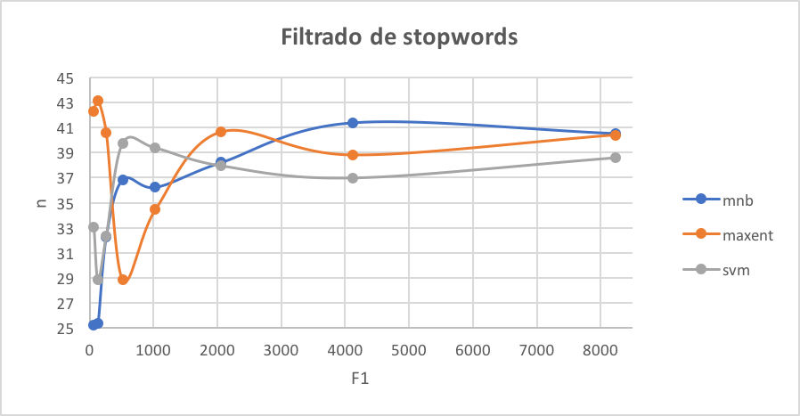

# Práctico 3

## Ejercicio 1: Corpus de Tweets: Estadísticas Básicas
Se genera el archivo `stats.py` que mostrará estadísticas sobre el corpus
de tweets de `InterTass` y `GeneralTASS`. Se muestra a continuación el
resultado que se obtiene de ejecutar el script.

```
Estadísticas de InterTass
================
Cantidad total de tweets: 1008
Cantidad de tweets con polaridad P: 318
Cantidad de tweets con polaridad N: 418
Cantidad de tweets con polaridad NEG: 133
Cantidad de tweets con polaridad NONE: 139
================


Estadísticas de GeneralTass
================
Cantidad total de tweets: 7219
Cantidad de tweets con polaridad P: 2884
Cantidad de tweets con polaridad N: 2182
Cantidad de tweets con polaridad NEG: 670
Cantidad de tweets con polaridad NONE: 1483
================
```

## Ejercicio 2: Mejoras al Clasificador Básico de Polaridad
En este ejercicio se implementan cuatro mejoras en el clasificador de
sentimientos ya implementado. Se decidió implementar las siguientes:

* **Mejor Tokenizer**: Se resuelve utilizando el tokenizer para tweets
del NLTK.
* **Normalización Básica de Tweets**: Antes de entrenar el corpus, se
_limpian_ las oraciones eliminando las referencias a otros usuarios,
las urls y las repeticiones de vocales.
* **Filtrado de stopwords**: Se setea el `CountVectorizer` para que ignore
stopwords del castellano. Se utiliza el que provee NLTK.
* **Stemming**: Se modifica el tokenizador del `CountVectorizer` para que
haga stemming sobre las palabras. Se utiliza el Snowball stemmer que provee
NLTK. 

Veamos que ocurra al implementar cada una de las mejoras por separado
y al implementar todas en conjunto.

Resultados de la curva de aprendizaje para los tres clasificadores.
### Mejor Tokenize


### Normalización Básica de Tweets


### Filtrado de stopwords



### Stemming


<!-------------------------------->
<!--Resultado de la evaluación sobre el corpus de development de InterTASS. Usar el script eval.py.-->
### Mejor Tokenize
#### mnb
```
Sentiment P:
  Precision: 51.61% (128/248)
  Recall: 82.05% (128/156)
  F1: 63.37%
Sentiment N:
  Precision: 58.20% (149/256)
  Recall: 68.04% (149/219)
  F1: 62.74%
Sentiment NEU:
  Precision: 100.00% (0/0)
  Recall: 0.00% (0/69)
  F1: 0.00%
Sentiment NONE:
  Precision: 100.00% (2/2)
  Recall: 3.23% (2/62)
  F1: 6.25%
Accuracy: 55.14% (279/506)
Macro-Precision: 77.45%
Macro-Recall: 38.33%
Macro-F1: 51.28%
	P	N	NEU	NONE
P	128	28	0	0
N	70	149	0	0
NEU	28	41	0	0
NONE	22	38	0	2
```

#### maxent
```
Sentiment P:
  Precision: 53.30% (105/197)
  Recall: 67.31% (105/156)
  F1: 59.49%
Sentiment N:
  Precision: 62.04% (134/216)
  Recall: 61.19% (134/219)
  F1: 61.61%
Sentiment NEU:
  Precision: 29.41% (5/17)
  Recall: 7.25% (5/69)
  F1: 11.63%
Sentiment NONE:
  Precision: 21.05% (16/76)
  Recall: 25.81% (16/62)
  F1: 23.19%
Accuracy: 51.38% (260/506)
Macro-Precision: 41.45%
Macro-Recall: 40.39%
Macro-F1: 40.91%
	P	N	NEU	NONE
P	105	26	7	18
N	53	134	3	29
NEU	24	27	5	13
NONE	15	29	2	16
```

#### svm
```
Sentiment P:
  Precision: 54.89% (101/184)
  Recall: 64.74% (101/156)
  F1: 59.41%
Sentiment N:
  Precision: 63.27% (124/196)
  Recall: 56.62% (124/219)
  F1: 59.76%
Sentiment NEU:
  Precision: 13.95% (6/43)
  Recall: 8.70% (6/69)
  F1: 10.71%
Sentiment NONE:
  Precision: 22.89% (19/83)
  Recall: 30.65% (19/62)
  F1: 26.21%
Accuracy: 49.41% (250/506)
Macro-Precision: 38.75%
Macro-Recall: 40.18%
Macro-F1: 39.45%
	P	N	NEU	NONE
P	101	26	12	17
N	45	124	17	33
NEU	25	24	6	14
NONE	13	22	8	19
```

### Normalización Básica de Tweets
#### mnb
```
Sentiment P:
  Precision: 47.23% (128/271)
  Recall: 82.05% (128/156)
  F1: 59.95%
Sentiment N:
  Precision: 59.31% (137/231)
  Recall: 62.56% (137/219)
  F1: 60.89%
Sentiment NEU:
  Precision: 0.00% (0/1)
  Recall: 0.00% (0/69)
  F1: 0.00%
Sentiment NONE:
  Precision: 66.67% (2/3)
  Recall: 3.23% (2/62)
  F1: 6.15%
Accuracy: 52.77% (267/506)
Macro-Precision: 43.30%
Macro-Recall: 36.96%
Macro-F1: 39.88%
	P	N	NEU	NONE
P	128	27	1	0
N	81	137	0	1
NEU	40	29	0	0
NONE	22	38	0	2
```

#### maxent
```
Sentiment P:
  Precision: 51.32% (117/228)
  Recall: 75.00% (117/156)
  F1: 60.94%
Sentiment N:
  Precision: 61.46% (126/205)
  Recall: 57.53% (126/219)
  F1: 59.43%
Sentiment NEU:
  Precision: 22.22% (4/18)
  Recall: 5.80% (4/69)
  F1: 9.20%
Sentiment NONE:
  Precision: 29.09% (16/55)
  Recall: 25.81% (16/62)
  F1: 27.35%
Accuracy: 51.98% (263/506)
Macro-Precision: 41.02%
Macro-Recall: 41.03%
Macro-F1: 41.03%
	P	N	NEU	NONE
P	117	26	5	8
N	63	126	7	23
NEU	32	25	4	8
NONE	16	28	2	16
```

#### svm
```
Sentiment P:
  Precision: 54.17% (104/192)
  Recall: 66.67% (104/156)
  F1: 59.77%
Sentiment N:
  Precision: 61.46% (118/192)
  Recall: 53.88% (118/219)
  F1: 57.42%
Sentiment NEU:
  Precision: 11.11% (4/36)
  Recall: 5.80% (4/69)
  F1: 7.62%
Sentiment NONE:
  Precision: 22.09% (19/86)
  Recall: 30.65% (19/62)
  F1: 25.68%
Accuracy: 48.42% (245/506)
Macro-Precision: 37.21%
Macro-Recall: 39.25%
Macro-F1: 38.20%
	P	N	NEU	NONE
P	104	25	11	16
N	49	118	15	37
NEU	26	25	4	14
NONE	13	24	6	19
```

### Filtrado de stopwords
```
#### mnb
Sentiment P:
  Precision: 43.88% (129/294)
  Recall: 82.69% (129/156)
  F1: 57.33%
Sentiment N:
  Precision: 60.71% (119/196)
  Recall: 54.34% (119/219)
  F1: 57.35%
Sentiment NEU:
  Precision: 20.00% (1/5)
  Recall: 1.45% (1/69)
  F1: 2.70%
Sentiment NONE:
  Precision: 54.55% (6/11)
  Recall: 9.68% (6/62)
  F1: 16.44%
Accuracy: 50.40% (255/506)
Macro-Precision: 44.78%
Macro-Recall: 37.04%
Macro-F1: 40.55%
	P	N	NEU	NONE
P	129	24	1	2
N	97	119	2	1
NEU	41	25	1	2
NONE	27	28	1	6
```

#### maxent
```
Sentiment P:
  Precision: 48.71% (113/232)
  Recall: 72.44% (113/156)
  F1: 58.25%
Sentiment N:
  Precision: 61.84% (128/207)
  Recall: 58.45% (128/219)
  F1: 60.09%
Sentiment NEU:
  Precision: 21.43% (3/14)
  Recall: 4.35% (3/69)
  F1: 7.23%
Sentiment NONE:
  Precision: 30.19% (16/53)
  Recall: 25.81% (16/62)
  F1: 27.83%
Accuracy: 51.38% (260/506)
Macro-Precision: 40.54%
Macro-Recall: 40.26%
Macro-F1: 40.40%
	P	N	NEU	NONE
P	113	29	2	12
N	66	128	6	19
NEU	31	29	3	6
NONE	22	21	3	16
```

#### svm
```
Sentiment P:
  Precision: 50.50% (101/200)
  Recall: 64.74% (101/156)
  F1: 56.74%
Sentiment N:
  Precision: 61.83% (115/186)
  Recall: 52.51% (115/219)
  F1: 56.79%
Sentiment NEU:
  Precision: 17.65% (6/34)
  Recall: 8.70% (6/69)
  F1: 11.65%
Sentiment NONE:
  Precision: 22.09% (19/86)
  Recall: 30.65% (19/62)
  F1: 25.68%
Accuracy: 47.63% (241/506)
Macro-Precision: 38.02%
Macro-Recall: 39.15%
Macro-F1: 38.57%
	P	N	NEU	NONE
P	101	28	6	21
N	56	115	16	32
NEU	26	23	6	14
NONE	17	20	6	19
```

### Stemming
#### mnb
```
Sentiment P:
  Precision: 48.46% (126/260)
  Recall: 80.77% (126/156)
  F1: 60.58%
Sentiment N:
  Precision: 60.25% (147/244)
  Recall: 67.12% (147/219)
  F1: 63.50%
Sentiment NEU:
  Precision: 0.00% (0/1)
  Recall: 0.00% (0/69)
  F1: 0.00%
Sentiment NONE:
  Precision: 100.00% (1/1)
  Recall: 1.61% (1/62)
  F1: 3.17%
Accuracy: 54.15% (274/506)
Macro-Precision: 52.18%
Macro-Recall: 37.38%
Macro-F1: 43.55%
	P	N	NEU	NONE
P	126	30	0	0
N	72	147	0	0
NEU	38	31	0	0
NONE	24	36	1	1
```

#### maxent
```
Sentiment P:
  Precision: 49.33% (110/223)
  Recall: 70.51% (110/156)
  F1: 58.05%
Sentiment N:
  Precision: 61.50% (131/213)
  Recall: 59.82% (131/219)
  F1: 60.65%
Sentiment NEU:
  Precision: 17.65% (3/17)
  Recall: 4.35% (3/69)
  F1: 6.98%
Sentiment NONE:
  Precision: 35.85% (19/53)
  Recall: 30.65% (19/62)
  F1: 33.04%
Accuracy: 51.98% (263/506)
Macro-Precision: 41.08%
Macro-Recall: 41.33%
Macro-F1: 41.21%
	P	N	NEU	NONE
P	110	31	5	10
N	64	131	6	18
NEU	34	26	3	6
NONE	15	25	3	19
```

#### svm
```
Sentiment P:
  Precision: 55.79% (106/190)
  Recall: 67.95% (106/156)
  F1: 61.27%
Sentiment N:
  Precision: 63.81% (134/210)
  Recall: 61.19% (134/219)
  F1: 62.47%
Sentiment NEU:
  Precision: 14.29% (5/35)
  Recall: 7.25% (5/69)
  F1: 9.62%
Sentiment NONE:
  Precision: 30.99% (22/71)
  Recall: 35.48% (22/62)
  F1: 33.08%
Accuracy: 52.77% (267/506)
Macro-Precision: 41.22%
Macro-Recall: 42.97%
Macro-F1: 42.07%
	P	N	NEU	NONE
P	106	26	11	13
N	45	134	13	27
NEU	28	27	5	9
NONE	11	23	6	22
```

### Todos las mejoras en conjunto
#### mnb
```
Sentiment P:
  Precision: 44.98% (130/289)
  Recall: 83.33% (130/156)
  F1: 58.43%
Sentiment N:
  Precision: 65.17% (131/201)
  Recall: 59.82% (131/219)
  F1: 62.38%
Sentiment NEU:
  Precision: 0.00% (0/3)
  Recall: 0.00% (0/69)
  F1: 0.00%
Sentiment NONE:
  Precision: 38.46% (5/13)
  Recall: 8.06% (5/62)
  F1: 13.33%
Accuracy: 52.57% (266/506)
Macro-Precision: 37.15%
Macro-Recall: 37.80%
Macro-F1: 37.48%
	P	N	NEU	NONE
P	130	20	1	5
N	85	131	1	2
NEU	44	24	0	1
NONE	30	26	1	5
```

#### maxent
```
Sentiment P:
  Precision: 50.44% (114/226)
  Recall: 73.08% (114/156)
  F1: 59.69%
Sentiment N:
  Precision: 67.20% (127/189)
  Recall: 57.99% (127/219)
  F1: 62.25%
Sentiment NEU:
  Precision: 16.67% (3/18)
  Recall: 4.35% (3/69)
  F1: 6.90%
Sentiment NONE:
  Precision: 30.14% (22/73)
  Recall: 35.48% (22/62)
  F1: 32.59%
Accuracy: 52.57% (266/506)
Macro-Precision: 41.11%
Macro-Recall: 42.72%
Macro-F1: 41.90%
	P	N	NEU	NONE
P	114	24	6	12
N	60	127	5	27
NEU	34	20	3	12
NONE	18	18	4	22
```

#### svm
```
Sentiment P:
  Precision: 50.50% (102/202)
  Recall: 65.38% (102/156)
  F1: 56.98%
Sentiment N:
  Precision: 62.92% (112/178)
  Recall: 51.14% (112/219)
  F1: 56.42%
Sentiment NEU:
  Precision: 15.56% (7/45)
  Recall: 10.14% (7/69)
  F1: 12.28%
Sentiment NONE:
  Precision: 32.10% (26/81)
  Recall: 41.94% (26/62)
  F1: 36.36%
Accuracy: 48.81% (247/506)
Macro-Precision: 40.27%
Macro-Recall: 42.15%
Macro-F1: 41.19%
	P	N	NEU	NONE
P	102	28	13	13
N	56	112	20	31
NEU	28	23	7	11
NONE	16	15	5	26
```

Por otro lado, utilizando el clasificador de `LogisticRegression` y únicamente
la mejora del tokenizer de `CountVectorizer` (utilizando el dado por NLTK
para tweets), se analizan los features para relevantes para cada sentimiento. Se observa el
siguiente resultado.

```
N:
	portada ;-) enhorabuena besos buena ([-1.79452324 -1.79368231 -1.32526974 -1.32309132 -1.31964222])
	denuncia odio recortes muertos triste ([1.61052392 1.6748671  1.73037801 2.00123788 2.35648441])
NEU:
	parados cree portada toda cont ([-1.0730947  -1.04328268 -0.991989   -0.98636185 -0.94534517])
	expectación decidirán huelga @palomacervilla broma ([1.2653491  1.29803474 1.32196108 1.32925949 1.40174105])
NONE:
	;-) feliz gracias gran mal ([-2.30151777 -1.89778751 -1.78622887 -1.74538428 -1.61962761])
	periódico jugar @juandevi reunión portada ([1.25238696 1.33131436 1.35854238 1.45107139 2.25093417])
P:
	culpa triste portada urdangarin odio ([-1.46645539 -1.410135   -1.37790085 -1.28120027 -1.20576306])
	felicidades gracias homenaje enhorabuena ;-) ([1.90229998 1.9487617  2.04845048 2.31960963 2.37839295])
```

Tomamos un ejemplo de tweet que contiene un feature que tiene un símbolo `;-)`.
La polaridad del tweet es `P`.

**"Dice Alex que muchas gracias por vuestras bienvenidas;-)"**

| Feature | Pesos probabilísticos ([N NEU NONE P]) |
|:-----:|:-----:|
| ;-) | [-1.79368231 -0.22029661 -2.30151777  2.37839295] |
| alex | [-0.11326911 -0.06889326  0.08940748  0.00153182] |
| bienvenidas | [-0.01485662 -0.02019998 -0.00738851  0.04737492] |
| dice | [ 0.12233488  0.02067206 -0.05337395 -0.10949083] |
| gracias | [-1.23867148 -0.5417023  -1.78622887  1.9487617 ] |
| muchas | [-0.13157362 -0.46685926 -0.2511654   0.2867084 ] |
| por | [ 0.10742165  0.05646907 -0.39634967  0.08869758] |
| que | [ 0.09681551  0.12266847 -0.37017259  0.00135437] |
| vuestras | [ 0.36766707  0.36782928 -0.15194554 -0.43273718] |

